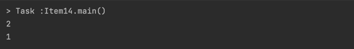

# Itme14. Comparable을 구현할지 고려하라

## Comparable의 특징
1. Comparable의 유일한 메서드 compareTo는 Object의 equals와 
동치성 비교에 더해 순서까지 비교가 가능하며, 제네릭하다는 점에서 차이가 있다.  
Comparable을 구현했다는 것은 그 클래스의 인스턴스들에는 자연적인 순서가 있음을 뜻한다. 
따라서 Comparable을 구현한 객체들의 배열은 Arrays.sort(a) 로 손쉽게 정렬 가능하다.

2. 검색, 극단값 계산, 자동 정렬되는 컬렉션 관리가 쉽다.
```java
import java.util.Collection;
import java.util.TreeSet;

public class WordList {
    public static void main(String[] args) {
        Set<String> s = new TreeSet;
        Collection.addAll(s, args);
        System.out.println(s);
    }
}
```
이 프로그램은 인수들의 중복을 제거하고 알파벳순으로 출력한다(TreeSet의 특징)
그렇기 때문에 알파벳, 숫자, 등 순서가 명확한 값 클래스를 작성한다면 반드시 Comparable 인터페이스를 구현하자.

## compareTo 메서드의 일반 규약
**기본 규약** : 이 객체와 주어진 객체의 순서를 비교한다. 이 객체가 더 작으면 음의 정수를 더 크면 양의 정수를 같으면 0을 반환한다.
만약 주어진 객체가 비교할 수 없는 객체라면 ClassCastException을 던진다.  
*sgn : 부호함수로 표현식의 값이 음수, 0, 양수일 때, -1, 0, 1을 반환한다고 정의한다.
- Comparable을 구현한 클래스는 모든 x, y에 대해 sgn(x.compareTo(y)) == -sgn(y.compareTo(x))여야 한다.
    x.compareTo(y)가 예외를 던질 때에 한해 y.compareTo(x)도 예외를 던져야한다. **(반사성)**
- Comparable을 구현한 클래스는 추이성을 보장해야 한다. 
    x.compareTo(y) > 0 && y.compareTo(z) > 0 이면 x.compareTo(z) > 0이다.
    * 추이성 : 집합 A에서 임의의 세 원소 a, b, c에 대하여 a와 b가 관계가 있고 b와 c가 관계가 있으면, a와 c가 관계가 있다.
- Comparable을 구현한 클래스는 모든 z에 대해 x.compareTo(y) == 0 이면 sgn(x.compareTo(y)) == sgn(y.compareTo(z))이다. **(대칭성)**
- (권고사항) (x.compareTo(y) == 0) == (x.equals(y))여야 한다. 이를 지키지 않는다면 다음과 같이 그 사실을 명시해야한다.
  **주의 : 이 클래스의 순서는 equals 메서드와 일관되지 않다.*

규약을 지킬 때 타입이 다른 객체를 신경 쓰지 않아도 된다. 다른 객체가 주어지면 ClassCastException을 던지면 되기때문이다.  
때로는, 서로 다른 타입의 비교를 허용하는데, 보통은 비교할 객체들이 구현한 공통 인터페이스를 매개로 이뤄진다.

compareTo 메서드로 수행하는 동치성 검사도 equals 규약과 똑같이 **반사성, 대칭성, 추이성**을 충족해야한다.  
따라서 기존 클래스를 확장한 구체 클래스에서 새로운 값 컴포넌트를 추가했다면 위의 규약을 지킬 방법이 없다는 것을 주의해야한다.
(확장하는 대신 독립된 클래스를 만들고, 이 클래스에 원래 클래스의 인스턴스를 가리키는 필드를 두고 뷰 메서드를 제공한다)

**권고사항에 대해..**  
해당 사항을 지킨다면 compareTo메서드로 수행한 동치성 테스트의 결과가 equals의 결과가 일관된다. 
compareTo의 순서와 equals의 결과가 일관되지 않은 클래스도 여전히 동작을 하지만, 
이 클래스의 객체를 정렬된 컬렉에 넣으면 해당 컬렉션이 구현한 인터페이스에 정의된 동작과 어긋날 것이다.
왜냐하면 정렬된 컬렉션의 경우 compareTo를 사용해 동치성을 비교하기 때문이다. 

```java
public static void main(String[] args){
        BigDecimal bd1 = new BigDecimal("1.0");
        BigDecimal bd2 = new BigDecimal("1.00");

        HashSet hs = new HashSet<>();
        TreeSet ts = new TreeSet();

        hs.add(bd1);
        hs.add(bd2);

        ts.add(bd1);
        ts.add(bd2);

        System.out.println(hs.size());
        System.out.println(ts.size());
    }
```


TreeSet의 경우 compareTo메서드로 HashSet의 경우 equals 메서드로 동치성 검사를 하기 때문에 위와같은 결과가 나온다.

## compareTo 메서드의 작성 요령
Comparable은 타입을 인수로 받는 제네릭 인터페이스로 compareTo 메서드의 인수 타입은 컴파일타임에 정해진다. 
즉, 입력인수의 타입을 확인하거나 형변환할 필요가 없이 그 타입이 잘못된다면 컴파일 자체가 되지않고, null을 인수로 넣는다면 NullPointerException을 던져야한다.


## 비교자(Comparator)
compareTo는 각 필드가 동치인지 비교하는 것이 아니라 그 순서를 비교한다. 객체 참조 필드를 비교하려면 compareTo메서드를 재귀적으로 호출한다.
만약 Comparable을 구현하지 않은 필드나 표준이 아닌 순서로 비교해야할 때 사용하는 것이 비교자(Comparator)이다.
비교자는 직접 만들어도 되고, 자바가 제공하는 것 중에 골라 쓰면 된다.
```java
public final class CaseInsensitiveString implements Comparable<CaseInsensitiveString> {
    public int compareTo(CaseInsensitiveString cis) {
        return String.CASE_INSENSITIVE_ORDER.compare(s, cis.s);
    }
}
```
CaseInsensitiveString이 Comparable<CaseInsensitiveString>을 구현한 것은 CaseInsensitiveString의 참조는
CaseInsensitiveString참조와만 비교할 수 있다는 뜻이다.

```text
java7버전 이전에는 관계연산자인 <,> 또는 정적메서드 Double.compare, Float.compare를 사용할 것을 권했다.
하지만 7버전부터 박싱된 기본 타입 클래스들에 새로 추가된 정적 메서드인 compare를 이용하면 된다.
```

클래스에 핵심 필드가 여러개라면 가장 핵심적인 필드부터 비교한다. 이때 비교 결과가 0이 아니라면(=순서가 결정되면) 거기서 곧장 결과를 반환한다.
핵심필드가 똑같다면 다른 필드를 찾을 때까지 그다음 중요한 필드를 비교해나간다.
```java
public int compareTo(PhoneNumber pn) {
    int result = Short.compare(areaCode, pn.areaCode){
        if (result == 0){
            result = Short.compare(prefix, pn.prefix);
            if(result == 0) 
                result = Short.compare(lineNum, pn.lineNum);
        }
        return result;
    }
}
```
자바 8에서는 Comparator 인터페이스가 일련의 비교자 생성 메서드와 팀을 꾸려 메서드 연쇄 방식으로 비교자를 생성할 수 있게 되었다.
그리고 이 비교자들은 compareTo 메서드를 구현하는데 활용가능하지만 이는 약간의 성능 저하가 뒤따른다. 자바의 정적 임포트 기능을 이용해
정적 비교자 생성 메서드들을 그 이름만으로 사용할 수 있어 코드가 훨씬 깔끔해진다.
```java
private static final Comparator<PhoneNumber> COMPARATOR 
        = comparingInt((PhoneNumber pn) -> pn.areaCode) // --(1)
                        .thenComparingInt(pn -> pn.prefix)
                        .thenComparingInt(pn -> pn.lineNum);
public int compareTo(PhoneNumber pn) {
    return COMPARATOR.compare(this, pn);
}
```
comparingInt는 객체 참조를 int타입의 키에 맵핑하는 함수(키 추출 함수)를 인수로 받아, 그 키를 기준으로 순서를 정하는 비교자를 반환하는 메서드이다.
(1)의 경우에는 comparingInt가 람다를 인수로 받고, 이 람다는 PhoneNumber에서 추출한 지역 코드를 기준으로 전화번호 순서를 정하는 Comparator<PhoneNumber>를 반환한다.

thneComparingInt는 Comparator의 인스턴스 메서드로, int 키 추출자 함수를 입력으로 받아 다시 비교자를 반환한다.

## 객체 참조용 비교자 생성 메서드
객체 참조용 비교자 생성 메서드 중 comparing이라는 정적 메서드 2개가 다중정의되어 있다.
- 키 추출자를 받아서 그 키의 자연적 순서를 사용한다.
- 키 추출자 하나와 추출된 키를 비교할 비교자까지 총 2개의 인수를 받는다.

thenComparing메서드는 3개 다중정의 되어있다.
- 비교자 하나만 인수로 받아 그 비교자로 부차 순서를 정한다.
- 키 추출자를 인수로 받아 그 키의 자연적 순서로 보조 순서를 정한다.
- 키 추출자와 추출된 키를 비교하는 비교자까지 총 2개의 인수를 받는다


## 값의 차를 기준으로 하는 비교자(주의사항)
값의 차를 기준으로 첫 번째 값이 두번째 값보다 작으면 음수, 같으면 0, 크면 양수를 반환하는 경우
```java
static Comparator<Object> hashCodeOrder = new Comparator<>() {
    public int compare(Object o1, Object o2) {
        return o1.hashCode() - o2.hashCode();
    }
}
```
해당 코드는 사용하면 안된다. 정수 오버플로를 일으키거나 부동소수점 계산 방식에 오류가 날 수 있기 때문이다.
이러한 상황에선 다음 두가지의 방식을 사용하면 된다.
```java
// Method 1 compare함수 사용
static Comparator<Object> hashCodeOrder = new Comparator<>() {
    public int compare(Object o1, Object o2) {
        return Integer.compare(o1.hashCode(), o2.hashCode());
    }
}
```
```java
// Method 2 : 비교자 생성 메서드 사용
static Comparator<Object> hashCodeOrder = Comparator.comparingInt(o -> o.hashCode());
```