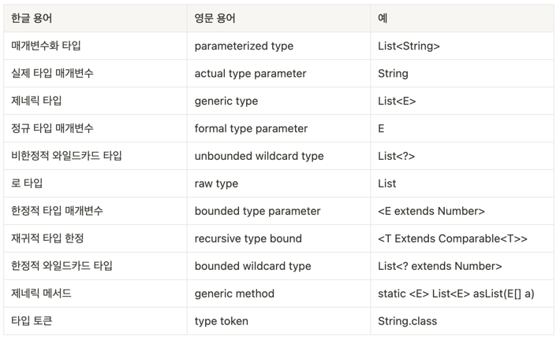

# Itme26. 로 타입은 사용하지 말라

## 제네릭 타입
클래스와 인터페이스 선언에 타입 매개변수가 쓰이면, 이를 제네릭 클래스 혹은 제네릭 인터페이스라 한다. 
```java
public interface List<E> extends Collection<E> {
    // ...
}
```
List 인터페이스는 원소의 타입을 나타내는 타입 매개변수 E를 받는다. 그리고 제네릭 클래스와 제네릭 인터페이스를 통틀어 **제네릭 타입**이라고 한다.

제네릭 타입은 매개변수화 타입을 정의한다.
```java
List<String> list;
```
이때 List<String>은 원소의 타입이 String인 리스트를 뜻하는 매개변수화 타입이다.  
이때 String이 정규 타입 매개변수 E의 실제 타입 매개변수이다.  

제네릭 타입을 정의하면 그에 딸린 로 타입(raw Type)도 정의된다.
```java
List list;
```
로 타입은 제네릭을 도입하기 전 코드와 호환되도록 하기 위한 궁여지책이다. 제네릭 지원 전에는 컬렉션을 다음과 같이 선언하고 사용했다. 
```java
private final Collection stamps = ... ; // Stamp 인스턴스만 취급한다.

stamps.add(new Coin()); // 실수로 Coin타입을 넣는다

for (Iterator i = stamps.iterator(); i.hasNext();) {
    Stamp stamp = (Stamp)i.next(); // ClassCastException 오류를 던진다.
}
```
위와 같은 오류는 런타임에 문제를 겪게 되므로 좋은 코드가 아니다.   
제네릭을 활용하면 타입의 안전성을 확보할 수 있다.
```java
private final Collection<Stamp> stamps = ...;
```
위와 같이 선언한다면 Stamp용 컬렉션에 Coin타입을 넣는다면 컴파일 오류가 발생할 것이다.  
따라서 로 타입을 쓰면 제네릭이 안겨주는 안전성과 표현력을 모두 잃게 된다. 

## 그렇다면 로 타입은 언제 사용할 것인가?
로 타입은 제네릭 이전의 코드들과의 호환성을 위해 존재한다. 로 타입을 사용하는 메서드에 매개변수화 타입의 인스턴스를 넘겨도, 그 반대의 상황에도 동작해야만 한다.  

## 로 타입과 List&#60;Object&#62;

List와 같은 로 타입은 사용하면 안되지만 List<Object>와 같은 임의 객체를 허용하는 매개변수화 타입은 가능하다.  
이 둘의 차이는 로 타입은 제네릭 타입을 전혀 고려하지 않았다면 List<Object>의 경우는 모든 타입을 허용한다는 의미이다.  
즉, 매개변수로 List를 받는 메서드에는 List<String>을 넘길 수 있지만, List<Object>를 받는 메서드에는 넘길 수 없다.  
왜냐하면 List<String>은 로 타입인 List의 하위 타입이지만, List<Object>의 하위 타입이 아니기 때문이다.  
```java
public static void main(String[] args) {
    List<String> strings = new ArrayList<>();
    unsafeAdd(strings, Integer.valueOf(42)); // -- (3)
    String s = strings.get(0); // -- (1)
}

private static void unsafeAdd(List list, Object o) { //  -- (2)
    list.add(o); 
}
```
위의 코드에서 List는 로 타입으로 컴파일은 가능하지만 (1)에서 classCastException 오류가 발생할 것이다.  
이때 메서드의 매개변수 (2)에서 List 로타입을 List<Object>로 변경하면 어떻게 될까?  
(3)에서 오류 메시지가 출력되며 컴파일조차 되지 않을 것이다.  

## 비한정적 와일드카드  

비한정적 와일드카드 타입은 제네릭 타입을 쓰고 싶지만 실제 타입 매개변수가 무엇인지 신경 쓰고 싶지 않을 때 사용하며 ? 이다. 
```java
static int numElementsInCommon(Set<?> s1, Set<?> s2) {}
```
와 같이 쓰인다.  
그렇다면 비한정적 와일드카드 타입(ex. Set<?>)과 로 타입(ex. Set)의 차이는 무엇일까? 비한정적 와일드카드 타입은 타입안정성이 확보되지만, 로 타입은 그렇지 않다.  
아무 원소가 넣을 수 있는 로 타입과 달리 비한정적 와일드카드 타입은 어떤 원소도 넣을 수 없다. 

## 그 외 규칙
1. class 리터럴에는 로 타입을 사용한다. 
자바 명세에는 배열과 기본 타입(ex. List.class, String[].class, int.class)는 허용하지만 매개변수화 타입(ex. List<String>.class, List<?>.class)은 사용하지 못하게 한다.  
2. instanceof 연산자
instanceof 연산자는 비한정적 와일드카드 타입 이외의 매개변수화 타입에는 적용할 수 없다. 그리고 로 타입이든 비한정적 와일드카드 타입이든 똑같이 동작한다. 따라서 
<>를 쓰며 지저분하게 보이기보다 로 타입을 사용해 깔끔해보이도록 하자. 

## 용어 정리 
