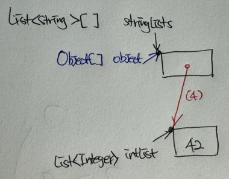

# Itme28. 배열보다는 리스트를 사용하라

배열과 제네릭의 차이점을 알아보자

## 배열은 공변, 제네릭은 불공변이다.

공변이란 a가 A의 하위 타입일 때, T &#60;a&#62; 가 T&#60;A&#62;의 하위 타입이면 T가 공변성질을 갖고 있다고 한다.  
따라서 배열은 Sub가 Super의 하위 타입이라면, 배열 Sub[]은 배열 Super[]의 하위 타입이 된다.
반대로, 제네릭은 서로 다른 타입 Type1, Type2가 있을 때, List<Type1>은 List<Type2>의 하위 타입도, 상위타입도 아니다. 

```java
Object[] objectArr = new Long[1];
objectArr[0] = "타입이 달라 넣을 수 없다."; // -- (1)

List<Object> objectList = new ArrayList<Long>();
objectList.add("타입이 달라 넣을 수 없다"); // -- (2)
```

(1)의 경우 런타임에서야 ArrayStoreException을 발생시키며 알 수 있지만, List를 사용하면 컴파일할 때 바로 알 수 있다. 

## 배열은 실체화(reify)가 된다.

배열은 런타임에도 자신이 담기로 한 원소의 타입을 인지하고 확인해 위의 예시에서 Long배열에 String을 넣을 때 ArrayStoreException을 발생시킨다.  
반면 제네릭은 타입 정보가 런타임에서는 소거된다. 따라서 컴파일타임에서만 검사하며 런타임에는 알 수조차 없다.

이상의 차이점으로 배열과 제네릭은 함께 쓸 수 없다. 

## 제네릭 배열은 타입이 안전하지 않다.

제네릭 배열을 만들지 못하는 이유는 타입 안전하지 않기 때문이다. 제네릭 배열을 허용한다면 컴파일러가 자동 생성한 형변환 코드에서 런타임에 ClassCastException이 
발생할 수 있다. 

```java
// 제네릭 배열을 허용한다면?
List<String>[] stringLists = new List<String>[1]; // -- (1)
List<Integer> intList = List.of(42); // -- (2)
Object[] objects = stringLists; // -- (3)
object[0] = intList; // -- (4)
String s = stringLists[0].get(0); // -- (5)
```



(1) ~ (4)의 코드를 그림화 하면 위와같다. 이때의 문제는 List<String> 인스턴스만 담겠다고 선언한 stringLists 배열에 List<Integer>가 저장되어있다.  
그리고 (5)은 String으로 형변환을 하는데 이 원소가 Integer이므로 런타임에 ClassCastException 이 발생한다.

E, List<E>, List<String> 과 같은 타입을 실체화 불가 타입이라고 한다. 소거 메커니즘 때문에 런타임에서 타입 정보를 적게 갖고, 
매개변수화 타입 가운데 실체활될 수 있는 타입은 List<?>와 Map<?,?>과 같은 비한정적 와일드 카드 타입뿐이다. 배열을 비한정적 와일드카드 타입으로 만들 수는 있지만, 유용하지않다. 

## 제네릭과 가변인수

제네릭 컬렉션에서는 자신의 원소 타입을 담은 배열을 반환하는 게 보통은 불가능하다. 따라서 가변인수 메서드의 경우 매 호출마다 가변인수
매개변수를 담을 배열이 하나 만들어지는데, 이때 제네릭 타입과 가변인수 메서드를 함께 쓰면 그 배열의 원소가 실체화 불가 타입이라고 경고가 발생한다.  
이러한 경고는 @SafeVarargs 애너테이션으로 대처 가능하다.  

## 형변환

배열로 형변환할 때 제네릭 배열 생성 오류나 비검사 형변환 경고가 뜨는 경우 대부분은 배열인 E[]보다 컬렉션인 List<E>를 사용하면 해결된다.  
코드가 복잡해지고 성능이 나빠질 수 있지만, 타입 안전성과 상호운용성은 좋아진다.   
Chooser클래스는 컬렉션 안의 원소 중 하나를 무작위로 선택해 반환하는 choose메서드를 제공한다. 
```java
public class Chooser {
    private final Object[] choiceArray;
    
    public Chooser(Collection choices) {
        choiceArray = choices.toArray();
    }
    
    public Object choose() {
        Random rnd = ThreadLocalRandom.current();
        return choiceArray[rnd.nextInt(choiceArray.lenth)];
    }
}
```
위의 코드는 제네릭을 사용하지 않고 구현한 버전이다. 이 버전의 클래스를 사용하려면 choose메서드를 호출할 때마다 반환된 Object를 원하는 타입으로
형변환해야한다. 혹시나 타입이 다른 원소가 들어 있었다면 런타임에 형변환 오류가 날 것이다. 
```java
public class Chooser<T> {
    private final T[] choiceArray;
    
    public Chooser(Collection<T> choices) {
        choiceArray = (T[])choices.toArray(); // (1) T가 무슨 타입인지 알 수 없으므로 컴파일러는 런타임에도 이 형변환이 안전할 지 보장할 수 없다는 경고가 뜬다. (동작O)
    }
    // choose 메서드는 그대로.
}
```
```java
public class Chooser<T> {
    private final T[] choiceArray;
    
    public Chooser(Collection<T> choices) {
        choiceList = new ArrayList<>(choices);
    }
    
    public T choose() {
        Random rnd = ThreadLocalRandom.current();
        return choiceList.get(rnd.nextInt(choiceList.size()));
    }
}
```
이렇게 고치게 되면 이전 버전의 ClassCastException이 발생할 일은 없으니 코드의 양이 늘고, 속도는 느리지만 가치가 있다.
